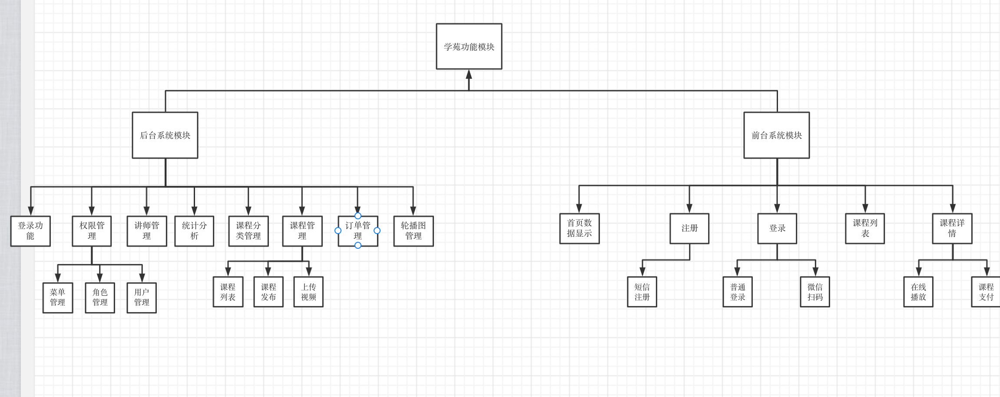

# 谷粒学院

# 一、功能简介

谷粒学院，是一个B2C模式的职业技能教育系统，分为前台用户系统和后台运营平台。

# 二、项目描述

1、在线教育系统，分为前台网站系统和后台运营平台，B2C模式。

使用了微服务技术架构，前后端分离开发。

前台用户系统包括：首页数据显示、课程列表和详情、名师详情、登录与注册、微信扫码登录、课程支付、课程播放.

后台管理系统包括：讲师管理、课程分类管理、课程管理、统计分析、轮播图管理、订单管理、权限管

理等功能。

后端的主要技术架构是：SpringBoot + SpringCloud + SpringSecurity + MyBatis-Plus + MySQL +

Maven+EasyExcel.

前端的架构是：Node.js + Vue.js +element-ui+NUXT+ECharts

其他涉及到的中间件包括Redis、阿里云OSS、阿里云视频点播, 阿里云短信服务、微信支付与微信扫码登录.

业务中使用了ECharts做图表展示，使用EasyExcel完成分类批量添加、注册分布式单点登录使用了JWT。

一句话总结：

***前端部分，使用主流的前端框架Vue，使用Es6的开发规范，采用模块化的开发模式。 后端部分，使用目前流行的SpringBoot+SpringCloud进行微服务架构，使用Feign、Gateway、Hystrix，以及阿里巴巴的Nacos等组件搭建了项目的基础环境。***

# 三、业务架构图

***后台系统功能***

```
1、登录功能（Spring security框架）
2、权限管理
	1、菜单管理：列表，添加、修改、删除
	2、角色管理：列表、添加、修改、删除、为角色分配菜单
	3、用户管理：列表、添加、修改、删除、为用户分配角色
	4、权限管理表和关系：五张表（权限、角色、用户、权限-角色、角色-用户). 多对多需要第三张表连接.
3、讲师管理模块
	条件查询分页列表、添加、修改、删除
4、课程分类模块
	1、添加课程分类
		读取excel里面分类数据、通过eastExcel添加到数据库.
	2、显示课程分类
		使用树形结构显示课程分类.
5、课程管理模块（核心）
	1、课程列表功能
	2、添加课程（课程发布的流程）
		1)填写课程基本信息
		2)添加课程大纲（章节和小节）
		3)课程信息的确认，最后发布->表中有个字段status-> normal.课程显示的是status为normal.
	问题：课程添加过程中，中途把课程停止添加，重新去添加新的课程，如何找到之前没有发布完成课程，继续进行发布呢？* 在课程列表中可以查询未发布课程, 找到想要继续发布的课程，点击课程右边超链接把课程继续发布完成，
	如何判断课程已经发布?
	* 通过给数据库设置字段status来判断他现在的状态.
	3、添加小节上传课程视频
6、统计分析模块
	1、后台定时任务统计每日登录、注册、课时浏览数进行统计.
	2、统计数据图表显示（echarts）
7、轮播图管理
	添加与删除
8、订单管理
	查看已支付 和未支付的情况.
```

***前台系统功能***

```
1、系统首页数据显示
	1、banner 幻灯片功能.
	幻灯片什么时候显示->? 根据id排序, 找最新的二条显示.
	2、显示热门课程.
	根据播放量降序显示.
	3、显示名师大咖.
2、注册功能
	1、获取手机验证码注册.
3、登录功能（单点登录sso实现）
	1、普通登录
	2、微信扫码登录 重要
	oauth2:一种解决方案
	* sso(单点登录如何实现的)
		我使用的是token的方式，用户登录成功后，根据相关的信息生成token，然后返回给cookie，他每次访问的时候		都会从请求头中获取token的值，并解析获取用信息，判断是否已经登录
4、名师列表
5、名师详情功能
6、课程列表
	1、条件查询分页功能
7、课程详情页
	1、课程信息显示（包含课程基本信息、分类、讲师、课程大纲（章节小节））
	2、判断视频是否购买
8、课程视频在线播放
9、课程支付功能
	1、生成课程订单.
	2、生成微信支付二维码
	3、微信最终支付.
	*微信支付实现流程
```




# 四 、技术架构图

1、前端技术点

```
前后端分离开发
前端前台系统使用Nuxt（vue）,服务端渲染技术，便于seo
前端后台系统使用vue-admin-template(基于vue+elementui)
前端：
	1、vue
		基本语法
		指令：v-bind，v-for，v-if，v-html，绑定事件@click
		生命周期：created（页面渲染之前）、mounted（页面挂载之前）
	ES6规范
	2、element-ui
	3、环境：nodejs, (js允许环境)
	4、NPM包管理器, 类似于maven; npm init 、 npm install \
	5、babel 转码器、es6->es5.
	6、前端模块化. api中定义方法、vue页面引入js文件.
	ES6使用 export 和 import 来导出、导入模块。
	问题：es6的模块化无法在node.js中运行，需要用babel转成es5才能运行.无需手动转，vue框架自动帮我们做了
	7、webpack
	Webpack 可以将多种静态资源 js、css、less 转换成一个静态文件，减少了页面的
请求。
	8、echarts 图表工具，使用了折线图.
```

2、后端技术点

```
1、微服务架构
2、springboot
	springboot本质就是spring，只是快速构建spring工程脚手架
	细节：包扫描：启动类同级包下面, 还可以手动设置扫描规则:@ComponentScan("")
	配置类：@Configuration
	配置文件:properties、yaml、yml. bootstrap配置文件优先级最高
3、Spring cloud
	是很多框架总称，使用这些框架实现微服务框架、基于springboot.
	组成框架：1、如下图
	项目中使用了阿里巴巴Nacos，代替springcloud一些组件
	使用nacos作为配置中心，使用nacos作为配置中心.
	Feign：服务调用，一个微服务调用宁外一个微服务，实现远程调用。
	熔断器Hystrix.
	springcloud 之前使用的zuul网关，目前gateway网关
	springcloud版本对应	
* spring security
	在项目中整合权限框架实现权限管理功能
	spring security框架组成：认证和授权
	spring security登录认证过程
	spring securoty代码执行过程
	
* redis
	1、首页数据进行缓存.
	2、redis数据类型：字符串、list 、set、hash 、zset
	3、不太重要或者不经常改变但经常访问的数据适合做缓存.
* nginx
	1、反向代理服务器
	2、请求转发、负载均衡、动静分离
* Oauth2 + JWT
	1、Othau2针对特点问题解决方案
	2、jwt包含三部分
* httpClient
	1、发送请求返回响应的工具，不需要浏览器完成请求和访问的过程
	2、应用场景：wx登录获取扫码人信息、微信支付查询支付信息
* cookie
	1、cookie特点：客户端技术，每次你发送请求都会带着cookie值进行发送. cookie有默认有效时长，关闭浏览器cookie就不存在了.通过setMaxAge可以设置.

4、mybatis-plus
	what：mp就是mybatis的增强.
	自动填充
	乐观锁
	逻辑删除
	代码生成器
5、easyexcel
	alibaba操作excel的工具, 读写速度高.(对poi进行封装,采用sax方式解析.poi是把数据全部装进内存，现在sax是一行一行解析,不会产生内存溢出的情况)
6、阿里云oss
	1、对象存储, 上传讲师头像.
7、阿里云视频点播，视频上传.
	1、视频上传，删除，播放
	2、整合阿里云视频播放器进行视频播放
		视频地址和凭证播放区别, 加密了视频使用视频地址是不可以播放的，只要凭证才能。
* 阿里云短信服务
	注册发送手机验证码.
8、微信扫码登录
*流程
9、微信支付
*流程
10、maven
11、git
```


# End、遇到的问题

**1、统一返回的json时间格式问题**

默认情况下json时间格式带有时区, 并且是世界标准时间, 和我们的时间差了8个小时.

在application.prperties里面配置

```
spring.jackson.date-format=yyyy-MM-dd HH:mm:ss
spring.jackson.time-zone=GMT+8
```

**2、跨域问题**

什么是跨域：浏览器从一个域名的网页去请求另一个域名的资源时, 域名、端口、协议任一不同. 就会产生跨域问题.

解决办法：

* controller上加上@CrosOrigin注解
* 通过配置类CorsConfiguration配置allowMethod、allowOrigin、allowheader解决.

**3、路由切换问题**

vue-router导航切换 时，如果两个路由都渲染同个组件，组件会重（chong）用,

组件的生命周期钩子（created）不会再被调用, 使得组件的一些数据无法根据 path的改变得到更新

因此：

1、我们可以在watch中监听路由的变化，当路由变化时，重新调用created中的内容

```javascript
watch: {  //监听
    $route(to, from) { //路由变化方式，路由发生变化，方法就会执行
        this.courseInfo={}
}
```

2、在init方法中我们判断路由的变化，如果是修改路由，则从api获取表单数据，

如果是新增路由，则重新初始化表单数据（通过param判断）

```js
init() {
//判断路径有id值,做修改
if(this.$route.params && this.$route.params.id) {
//从路径获取id值
const id = this.$route.params.id
//调用根据id查询的方法
this.getInfo(id)
} else { //路径没有id值，做添加
//清空表单
this.teacher = {}
}
},
```

**4、oss模块中有数据库的依赖, 但配置文件没有配置数据源,导致启动报错**

spring boot 会默认加载org.springframework.boot.autoconfigure.jdbc.DataSourceAutoConfiguration这个类，而DataSourceAutoConfiguration类使用了@Configuration注解向spring注入了dataSource bean，又因为项目（oss模块）中并没有关于dataSource相关的配置信息，所以当spring创建dataSource bean时因缺

少相关的信息就会报错。

解决：

```java
@SpringBootApplication(exclude = DataSourceAutoConfiguration.class)
```

**5、oss模块上传图片413错误(Request Entity Too large)报错**

使用了nginxweb服务器，并且上传到文件比较大时, 会爆413 Request Entity Too large 的错误.

解决办法：修改nginx的最大上传限制

```
client_max_body_size  1024m;  #最大限制为1024M
```

之后测试再上传一个大一点的图片, 爆：

```
org.springframework.web.multipart.MaxUploadSizeExceededException
```

是因为springboot 自动配置了对上传文件大小的限制, 默认单个文件最大1Mb,单次请求文件总数大小最大10Mb

修改为

```
spring.servlet.multipart.max-file-size = 20MB
spring.servlet.multipart.max-request-size=20MB
```

**6、properties文件中 '=' 右边不能加空格，末尾也是.**

**7、maven打包问题**

***问题一：***

Maven 加载的时候，把Java文件夹里面.java文件类型文件进行编译，如果有其他类型文件不会加载.

解决办法：

* 将xml复制到target目录下

* 配置。

    * mybatis-plus.mapper-locations=classpath:com/atguigu/educenter/mapper/xml/*.xml

    * pom.xml 中配置将打包时会将java目录中的*.xml文件也进行打包


***问题二***

Maven package打jar包的时候, 默认不会将resources下的文件打入classes文件夹, 导致启动jar包无法加载配置文件.

解决办法：

```maven
<resource>
    <directory>src/main/resources</directory>
    <includes>
        <include>**.*</include>
        <include>**/*.*</include>
        <include>**/*/*.*</include>
    </includes>
</resource>
```

***问题三***

多模块打包问题：多个模块具有依赖, 常规的打包方式不实用了.

解决办法：

parent pom下加入

```
<configuration>
    <executable>true</executable>
    <includeSystemScope>true</includeSystemScope>
</configuration>
```

common pom 下加入

```
<configuration>
	<skip>true</skip>
</configuration>
```

其他pom文件把<build>标签删掉！

**8、前端问题：es6模块化运行问题：**

问题：import 外部 js 文件问题 报错

解决：Nodejs使用Babel把Es6代码转换Es5代码执行

**9、Mybatis-plus id问题**

mp生成id值长度为19位, js处理数字类型的时候只能处理到16位, 所以将id类型改为字符串类型.

413:请求体过大

403:跨域

302:访问一个Url时，被重定向到另一个url上。常用于页面跳转

# 微服务

## 一、什么是微服务

微服务最早由Martin Fowler与James Lewis于2014年共同提出，微服务架构风格是一种使用一套小服务来开发单个应用的方式途径，每个服务运行在自己的进程中，并使用轻量级机制通信，通常是HTTP API，这些服务基于业务能力构建，并能够通过自动化部署机制来独立部署，这些服务使用不同的编程语言实现，以及不同数据存储技术，并保持最低限度的集中式管理。

## 二、为什么需要微服务

在传统的IT行业软件大多都是各种独立系统的堆砌，这些系统的问题总结来说就是扩展性差，可靠性不高，维护成本高。到后面引入了SOA(Service Oriented Architecture)服务化，但是，由于 SOA 早期均使用了总线模式，这种总线模式是与某种技术栈强绑定的，比如：J2EE。这导致很多企业的遗留系统很难对接，切换时间太长，成本太高，新系统稳定性的收敛也需要一些时间。

## 三、微服务与单体架构的区别

（1）单体架构所有的模块全都耦合在一块，代码量大，维护困难。

微服务每个模块就相当于一个单独的项目，代码量明显减少，遇到问题也相对来说比较好解决。

（2）单体架构所有的模块都共用一个数据库，存储方式比较单一。

微服务每个模块都可以使用不同的存储方式（比如有的用redis，有的用mysql等），数据库也是单

个模块对应自己的数据库。

（3）单体架构所有的模块开发所使用的技术一样。

微服务每个模块都可以使用不同的开发技术，开发模式更灵活。

## 四、微服务开发框架

目前微服务的开发框架，最常用的有以下四个：

Spring Cloud：http://projects.spring.io/spring-cloud（现在非常流行的微服务架构）

Dubbo：http：//dubbo.io

Dropwizard：http://www.dropwizard.io （关注单个微服务的开发）

Consul、etcd&etc.（微服务的模块）

## 五、什么是springcloud

Spring Cloud是一系列框架的集合。它利用Spring Boot的开发便利性简化了分布式系统基础设施的开

发，如服务发现、服务注册、配置中心、消息总线、负载均衡、 熔断器、数据监控等，都可以用Spring

Boot的开发风格做到一键启动和部署。Spring并没有重复制造轮子，它只是将目前各家公司开发的比较

成熟、经得起实际考验的服务框架组合起来，通过SpringBoot风格进行再封装屏蔽掉了复杂的配置和实

现原理，最终给开发者留出了一套简单易懂、易部署和易维护的分布式系统开发工具包

## 六、springcloud 与springboot的区别

Spring Boot 是 Spring 的一套快速配置脚手架，可以基于Spring Boot 快速开发单个微服务。

Spring Cloud是一个基于Spring Boot实现的开发工具；Spring Boot专注于快速、方便集成的单个微服务个体，Spring Cloud关注全局的服务治理框架； Spring Boot使用了默认大于配置的理念，很多集成方案已经帮你选择好了，能不配置就不配置，Spring Cloud很大的一部分是基于Spring Boot来实现，必须基于Spring Boot开发。可以单独使用Spring Boot开发项目，但是Spring Cloud离不开 Spring Boot。

## 七、spring cloud相关基础组件

服务发现——Netflix Eureka （Nacos）

服务调用——Netflix Feign

熔断器——Netflix Hystrix

服务网关——Spring Cloud GateWay

分布式配置——Spring Cloud Config （Nacos）

消息总线 —— Spring Cloud Bus （Nacos）

## 八、springcloud 小版本

Spring Cloud 小版本分为:

SNAPSHOT： 快照版本，随时可能修改

M： MileStone，M1表示第1个里程碑版本，一般同时标注PRE，表示预览版版。

SR： Service Release，SR1表示第1个正式版本，一般同时标注GA：(GenerallyAvailable),表示稳定版

本。

## 九、项目中使用的微服务组件

### 九.一 Nacos注册中心

1、基本概念

Nacos 致力于帮助您发现、配置和管理微服务, 属于阿里巴巴

2、本地启动

nacos/conf 下执行nacos-mysql.sql 脚本, 在本地生成数据库表.

修改applicaiton.properties配置文件, 修改数据库连接用户名、密码等.

启动：bin 目录下

`./startup.sh -m standalone`

3、nacos功能

* 服务发现和服务健康检测
* 动态配置服务

### 九.二 Feign

1、基本概念

Feign是Netflix开发的声明式、模板化的HTTP客户端， Feign可以帮助我们更快捷、优雅地调

用HTTP API。

转化请求Feign是一个http请求调用的轻量级框架，可以以Java接口注解的方式调用Http请求，封装了Http调用流程。

2、导入依赖

```
spring-cloud-starter-openfeign
```

3、启动类添加注解

```
@EnableFeignClients
```

4、创建包和接口

@FeignClient注解用于指定从哪个服务中调用功能 ，名称与被调用的服务名保持一致。

@DeleteMapping注解用于对被调用的微服务进行地址映射。

@PathVariable注解一定要指定参数名称，否则出错

@Component注解防止，在其他位置注入vodClient时idea报错

```
@FeignClient("service-vod")
@Component
public interface VodClient {
@DeleteMapping(value = "/eduvod/vod/video/{videoId}")
public R removeVideo(@PathVariable("videoId") String videoId);
```

### 九.三 Hystrix

Spring Cloud 在接口调用上，大致会经过如下几个组件配合：

Feign ----->Hystrix —>Ribbon —>Http Client（apache http components 或者 Okhttp） 具体交互流程上，如下

图所示：


（1）接口化请求调用当调用被@FeignClient注解修饰的接口时，在框架内部，将请求转换成Feign的请求实例feign.Request，交由Feign框架处理。

（2）**Feign** ：转化请求Feign是一个http请求调用的轻量级框架，可以以Java接口注解的方式调用Http请求，封装了Http调用流程。

（3）**Hystrix**：熔断处理机制 Feign的调用关系，会被Hystrix代理拦截，对每一个Feign调用请

求，Hystrix都会将其包装成HystrixCommand,参与Hystrix的流控和熔断规则。如果请求判断需要熔断，则Hystrix直接熔断，抛出异常或者使用FallbackFactory返回熔断Fallback结果；如果通过，则将调用请求传递给Ribbon组件。

（4）**Ribbon**：服务地址选择 当请求传递到Ribbon之后,Ribbon会根据自身维护的服务列表，根据服务的服务质量，如平均响应时间，Load等，结合特定的规则，从列表中挑选合适的服务实例，选择好机器之后，然后将机器实例的信息请求传递给Http Client客户端，HttpClient客户端来执行真正的Http接口调用；

（5）**HttpClient** ：Http客户端，真正执行Http调用根据上层Ribbon传递过来的请求，已经指定了服务地址，则HttpClient开始执行真正的Http请求

1、Hystrix概念

Hystrix 是一个供分布式系统使用，提供延迟和容错功能，保证复杂的分布系统在面临不可避免的失败

时，仍能有其弹性。比如系统中有很多服务，当某些服务不稳定的时候，使用这些服务的用户线程将会阻塞，如果没有隔离机制，系统随时就有可能会挂掉，从而带来很大的风险。SpringCloud使用Hystrix组件提供断路器、资源隔离与自我修复功能。 简称：**兜底**

2、引入依赖

```
spring-cloud-starter-netflix-hystrix
```

3、配置文件

```
#开启熔断机制
feign.hystrix.enabled=true
# 设置hystrix超时时间，默认1000ms
hystrix.command.default.execution.isolation.thread.timeoutInMilliseconds=6000
```

4、开始兜底

```
@FeignClient(name = "service-vod", fallback = VodFileDegradeFeignClient.class)
指定VodFileDegradeFeignClient这个类兜底
```

### 九、四sprincloud gateway

API 网关是介于客户端和服务器端之间的中间层，所有的外部请

求都会先经过 API 网关这一层。也就是说，API 的实现方面更多的考虑业务逻辑，而安全、性能、监控

可以交由 API 网关来做

### 九、五spring cloud config

Spring Cloud Config 为分布式系统的外部配置提供了服务端和客户端的支持方案.server提供配置文件的存储、以接口的形式将配置文件的内容提供出去，client通过接口获取数据、并依据此数据初始化自己的应用。

**使用nacos替换config**

系统配置的集中管理（编辑、存储、分发）、动态更新不重启、回滚配置（变更管理、

历史版本管理、变更审计）等所有与配置相关的活动

## 十、Redis

1、介绍

Redis是当前比较热门的NOSQL系统之一，它是一个开源的使用ANSI c语言编写的key-value存储系统（区别于MySQL的二维表格的形式存储）。和Memcache类似，但很大程度补偿了Memcache的不

足。和Memcache一样，Redis数据都是缓存在计算机内存中，不同的是，Memcache只能将数据缓存到内存中，无法自动定期写入硬盘，这就表示，一断电或重启，内存清空，数据丢失。所以Memcache的应用场景适用于缓存无需持久化的数据。而Redis不同的是它会周期性的把更新的数据写入磁盘或者把修改操作写入追加的记录文件，实现数据的持久化。

2、Redis特点

* Redis读取的速度是110000次/s，写的速度是81000次/s；

* 原子 。Redis的所有操作都是原子性的，同时Redis还支持对几个操作全并后的原子性执行。

* 支持多种数据结构：string（字符串）；list（列表）；hash（哈希），set（集合）；zset(有序集合)

* 持久化，集群部署

* 支持过期时间，支持事务，消息订阅

3、maven依赖

spring-boot-starter-data-redis

commons-pool2

4、redis使用场景

* 热点数据的缓存
    * 对于访问量大单不经常修改的数据适合进行缓存 例如首页数据
* 限时业务的运用
    * 短信验证码
* 计算器相关问题
    * incrby命令可以实现原子性的递增. 可用于分布式id的生成

5、spingboot缓存注解

* @Cacheable
    * 根据方法对其返回结果进行缓存，下次请求时，如果缓存存在，则直接读取缓存数据返回；如果缓存不存在，则执行方法，并把返回的结果存入缓存中。一般用在查询方法上。
* @CachePut
    * 使用该注解标志的方法，每次都会执行，并将结果存入指定的缓存中。其他方法可以直接从响应的缓存中读取缓存数据，而不需要再去查询数据库。一般用在新增方法上。
* CacheEvict
    * 使用该注解标志的方法，会清空指定的缓存。一般用在更新或者删除方法上

6、redis启动

* 1、关闭linux防火墙
* 2、找到redis.conf, 注释掉 #bind 127.0.0.1

# 每日统计数据

使用定时任务, 每日凌晨执行.

配合Echarts使用.

# :star2:权限管理

不同角色的用户登录后台管理系统拥有不同的菜单权限与功能权限，权限管理包含三个功能模块：菜单

管理、角色管理和用户管理.

rbac:Role-Based Access Control 基于角色的访问控制. like persona.
RBAC 认为 “授权”实际上是Who、What、How三元组之间的关系, 也就是Who对What进行How的操作.

数据库五张表


## 菜单（权限）管理

使用树形结构显示..

给角色分配权限

## 角色管理

角色的CRUD.

## 用户管理

用户CRUD.

给用户分配角色.

# :star2:Spring Security

## 介绍

Spring Security 基于 Spring 框架，提供了一套

Web 应用安全性的完整解决方案。一般来说，Web 应用的安全性包括用户认证（**Authentication**）和用

户授权（**Authorization**）两个部分。

（1）用户认证指的是：验证某个用户是否为系统中的合法主体，也就是说用户能否访问该系统。用户认

证一般要求用户提供用户名和密码。系统通过校验用户名和密码来完成认证过程。

（2）用户授权指的是验证某个用户是否有权限执行某个操作。在一个系统中，不同用户所具有的权限是

不同的。比如对一个文件来说，有的用户只能进行读取，而有的用户可以进行修改。一般来说，系统会

为不同的用户分配不同的角色，而每个角色则对应一系列的权限。

**Spring Security**其实就是用**filter**，多请求的路径进行过滤。

（1）如果是基于Session，那么Spring-security会对cookie里的sessionid进行解析，找到服务器存储

的sesion信息，然后判断当前用户是否符合请求的要求。

（2）如果是token，则是解析出token，然后将当前请求加入到Spring-security管理的权限信息中去

## 认证与授权实现

如果系统的模块众多，每个模块都需要就行授权与认证，所以我们选择基于token的形式进行授权与认

证，用户根据用户名密码认证成功，然后获取当前用户角色的一系列权限值，并以用户名为key，权限列

表为value的形式存入redis缓存中，根据用户名相关信息生成token返回，浏览器将token记录到cookie中，

每次调用api接口都默认将token携带到header请求头中，Spring-security解析header头获取token信息，解

析token获取当前用户名，根据用户名就可以从redis中获取权限列表，这样Spring-security就能够判断当前

请求是否有权限访问.

代码实现：

核心配置类继承WebSecurityConfigurerAdapter, 并加上@EnableWebSecurity注解.

Spring-security 有专门的实体类UserDetails, 我们可以继承这个类.

我们需要继承一个UserDetailSevice接口并且加入到容器中，实现loadUserByUsername方法，里面的逻辑通常是从数据库查找出对应用户名的密码然后构造一个UserDetail对象，spring security会根据返回的这个带有正确用户信息的对象和前台传过来的用户名密码进行比对来判断是否认证通过。

# :star:用户登录

## 1、用户登录业务介绍

### 1.1、单一服务器模式

早期单一服务器, 用户认证。


缺点：单点性能压力, 无法扩展.

### 1.2、SSO(single sign on)模式

分布式：sso模式


优点：用户身份信息独立管理，更好的分布式管理

​			可以自己拓展安全策略

缺点：认证服务器访问压力比较大

### 1.3、Token模式

业务流程图：

优点：token无状态、session有状态

基于标准化：你的API可以采用标准化的JSON Web Token（JWT）

缺点：占用带宽, 无法在服务器端销毁.

基于微服务开发，选择token的形式相对较多，因此我使用token作为用户认证的标准

#### 1.3.1 使用JWT进行跨域身份验证

##### 1、传统用户身份验证


### 1.4、项目会员登录、注册业务流程

#### 1.4.1、登录

后台获取mobile、password二个字段, 校验数据库的加盐字段是否和password匹配. -> 返回jwt token.

#### 1.4.2、注册

获取到nickname、mobile、password、code四个字段. 从redis获取发送到验证码, 查询数据库中是否存在相同的手机号码, 如果存在说明这个手机号已经注册过了. --> 添加信息到数据库

#### 1.4.3、微信登录

***微信登录使用的是OAuth2授权机制, 使用的是具体的授权码方式实现.***

第一步：用户点击网站微信登录图标.

后端带上AppId 和 AppSecret和回调域名参数请求微信OAuth2授权.

```
String baseUrl = "https://open.weixin.qq.com/connect/qrconnect" +
        "?appid=%s" +  // 让微信知道是谁在请求
        "&redirect_uri=%s" +   // 是微信接受或拒绝请求后的跳转地址
        "&response_type=code" +  // response_type 表示要求返回授权码(code)
        "&scope=snsapi_login" +  // 表示要请求的授权范围
        "&state=%s" +
        "#wechat_redirect";
        //对redirect_url进行URLEncoder编码
  String redirectUrl = localhost:8160/api/ucenter/wx/callback; 
```

上面 URL 中，`response_type`参数表示要求返回授权码（`code`），`appid`参数让 微信 知道是谁在请求，`redirect_uri`参数是 微信 接受或拒绝请求后的跳转网址，`scope`参数表示要求的授权范围（这里是登录）。scope也表示资源分配着额外指定的细分权限. 这里是只能做登录.

第二步: 微信返回二维码供用户扫码

返回到字符串如下

```
https://open.weixin.qq.com/connect/qrconnect?appid=wxed9954c01bb89b47&redirect_uri=http%3A%2F%2Flocalhost%3A8160%2Fapi%2Fucenter%2Fwx%2Fcallback&response_type=code&scope=snsapi_login&state=atguigu#wechat_redirect
```

前端使用qrxxx组件将字符串转换为微信二维码.

第三步：会员扫码确认登录 , 也就是授权, **微信带上code回调redirect_uri**, 后端再带上code和appId和appSecret请求微信相关地址. 如下图

```java
        String baseAccessTokenUrl = "https://api.weixin.qq.com/sns/oauth2/access_token" +
                "?appid=%s" +
                "&secret=%s" +
                "&code=%s" +
                "&grant_type=authorization_code";  // 表示采用的方式是授权码
```

使用httpClient调用地址, 返回accessToken.

第四步: 获取accessToken中的appid（每个微信唯一标识）, feign调用接口, 通过appid查询ucenter_member这张表是否有存在此appid.

* 该用户第一次登录：拿着accessToken和appid请求微信相关地址, 得到该用户的名称, 头像等参数. 并将其加入到数据库中. 并生成jwt  token, 重定向到前端页面.

```
return "redirect:http://localhost:3000?token="+jwtToken;
```

* 改用户数据库里已经存在, 直接返回token + 重定向.

### 1.5、项目管理员登录、注册业务流程

[执行流程](https://blog.csdn.net/weixin_44588495/article/details/105907312)

使用spring-security 做用户的认证与授权.

认证流程：


我们自己写了个类继承PasswordEncoder, 重写encode和matches 方法. 使用的是md5加密。

授权流程：


用户登出流程：

通过request中的header的token, 获取到token到body到username, 清楚掉redis中username的key.

自定义生成token:TokenManager 类. token 生成，token解析, token过期时间.

# :star:微信支付

课程分为免费课程和付费课程，如果是免费课程可以直接观看，如果是付费观看的课程，用户需下

单支付后才可以观看

1、发起生成订单的请求, 我们拿到courseId和HttpServletRequest二个参数, request的header里面携带有token, 我们使用JWt工具类解析出用户id（我们使用jwt生成token时往token的body里面存放了id字段, 所有我们可以解析).根据courseId 和 userId 远程调用获取信息，存到order表里面，使用工具类生成订单id, 返回订单id.
2、前端跳转到订单去支付页面, 通过返回的订单id 调用api, 回显订单信息, 比如课程名称，支付金额 etc.
3、点击去支付, 后台生成微信支付二维码接口,需要商户appId, partnerkey,notifyurl准备条件。微信固定的api. 前端qriously组件解析二维码接口里面的code_url, 生成图片.
4、扫码支付：每隔5秒，通过订单id查询支付状态, 如果status=已支付,后台会将order表的状态改为1（已经支付），同时还会在pay_log表中新增一条记录。前台清除前端定时器,跳转到课程页面。


# :star2: 面试题

## 一、HTTP协议是有状态还是无状态的

### 1、1定义

Http无状态协议，是指协议对于交互性场景没有记忆能力.

### 1.2、举个例子

在点击一个纯的html网页，请求获取服务器的html文件资源时，每次http请求都会返回同样的信息，因为这个是没有交互的，每一次的请求都是相互独立的。第一个请求和第二个请求也没有先后顺序，返回处理哪个，结果都是同样的资源页面，因为这种场景是无交互的，无论是什么人请求这个地址，服务器都是返回那个相同的响应。

### 1.3、具体场景

如在购物网站上买一个书包：

* 输入用户名登录
* 选择一款你喜欢的书包加入到购物车中 /cart 用户信息，产品信息
* 购买支付 /pay 用户信息，商品信息，金额信息

所谓的登录只是验证你是否是一个合法用户，若是合法则跳转到信息的页面，不合法则告知用户名密码错误。但是我们在第一步给服务器发完/login接口后，服务器就忘记了。。。忘记了你这个人，到底有没有经过认证。所以在添加商品时/cart 你还是需要将你的账号密码和商品信息一起提交给 addCart接口，再让服务器做验证。

### 1.4、总结

上面的无状态是指的，无登录状态，即服务器不知道某个用户是否已登录过了。因为愚蠢的服务器不知道客户端是否已登录过了,所以每次都要在交互场景(会话)中请求中带上上一次的请求信息，如账号、密码。明明只需要在/login接口中，才需要对比数据库中的账号密码和客户端传的是否一致来确定合法性。这下在添加购物车中也需要再一次的进行同样的重复且没有必要的操作，即降低了响应速度，又对用户不友好（因为每次都需要填账号，密码）

## 二、cookie、session、token

对于http无状态的解决方案：

两种用于保持HTTP状态的技术就应运而生了，一个是 Cookie，而另一个则是Session.


#### 2.1、Cookie

Cookie 是客户端的存储空间，由浏览器来维持。具体来说 **cookie 机制采用的是在客户端保持状态的方案**。

**实现过程：**

cookie 是一个非常具体的东西，指的就是浏览器里面能永久存储的一种数据，仅仅是浏览器实现的一种数据存储功能。cookie由服务器生成，发送给浏览器，浏览器把cookie以kv形式保存到某个目录下的文本文件内，下一次请求同一网站时会把该cookie发送给服务器。由于cookie是存在客户端上的，所以浏览器加入了一些限制确保cookie不会被恶意使用，同时不会占据太多磁盘空间，所以每个域的cookie数量是有限的

Cookie在客户端是由浏览器来管理的。浏览器能够保证Google只会操作Google的Cookie而不会操作Baidu的Cookie，从而保证用户的隐私安全

cookie保存登录信息多种方案

- 方案一：最直接的是把用户名与密码都保持到Cookie中，下次访问时检查Cookie中的用户名与密码，与数据库比较。这是一种比较危险的选择，一般不把密码等重要信息保存到Cookie中。
- 方案二：是把密码加密后保存到Cookie中，下次访问时解密并与数据库比较。这种方案略微安全一些。如果不希望保存密码，还可以把登录的时间戳保存到Cookie与数据库中，到时只验证用户名与登录时间戳就可以了。
- 方案三：只在登录时查询一次数据库，以后访问验证登录信息时不再查询数据库。实现方式是把账号按照一定的规则加密后，连同账号一块保存到Cookie中。下次访问时只需要判断账号的加密规则是否正确即可

#### 2.2、Session

- Session，中文经常翻译为会话，其本来的含义是指有始有终的一系列动作/消息，比如打电话是从拿起电话拨号到挂断电话这中间的一系列过程可以称之为一个 Session。然而当 Session 一词与网络协议相关联时，它又往往隐含了“面向连接”或“保持状态”这样两个含义。

- Session 是另一种记录客户状态的机制，不同的是 Cookie 保存在客户端浏览器中，而 Session 保存在服务器上。

- 客户端浏览器访问服务器的时候，服务器把客户端信息以某种形式记录在服务器上，这就是 Session。客户端浏览器再次访问时，只需要从该 Session 中查找该客户的状态就可以了。

- 虽然 Session 保存在服务器，对客户端是透明的，它的正常运行仍然需要客户端浏览器的支持。这是因为 Session 需要使用Cookie 作为识别标志。HTTP协议是无状态的，Session 不能依据HTTP连接来判断是否为同一客户，因此服务器向客户端浏览器发送一个名为 JSESSIONID 的 Cookie，它的值为该 Session 的 id（即放在HTTP响应报文头部信息里的Set-Cookie）。Session依据该 Cookie 来识别是否为同一用户。

- 可是session有一个缺陷：如果web服务器做了负载均衡，那么下一个操作请求到了另一台服务器的时候session会丢失。


### 2.3、cookie 与session的区别

- cookie 是一个实际存在的、具体的东西，http 协议中定义在 header 中的字段。
- Session是另一种记录客户状态的机制，不同的是Cookie保存在客户端浏览器中，而Session保存在服务器上。
- 客户端浏览器访问服务器的时候，服务器把客户端信息以某种形式记录在服务器上。这就是Session。客户端浏览器再次访问时只需要从该Session中查找该客户的状态就可以了。
- 如果说Cookie机制是通过检查客户身上的“通行证”来确定客户身份的话，那么Session机制就是通过检查服务器上的“客户明细表”来确认客户身份。Session相当于程序在服务器上建立的一份客户档案，客户来访的时候只需要查询客户档案表就可以了。
- Cookie 不是很安全，别人可以分析存放在本地的COOKIE并进行COOKIE欺骗，考虑到安全应当使用 Session ；
- **session 传输数据少，数据结构灵活**：相较于 cookie 来说，session 存储在服务端，客户端仅保留换取 session 的用户凭证。因此传输数据量小，速度快。
- **session 更安全**：检验、生成、验证都是在服务端按照指定规则完成，而 cookie 可能被客户端通过 js 代码篡改。
- **session 的不足**：服务器是有状态的。多台后端服务器无法共享 session。**解决方法**是，专门准备一台 session 服务器，关于 session 的所有操作都交给它来调用。而服务器之间的调用，可以走内网 ip，走 RPC 调用（不走 http）。

### 2.4、Token

Token是服务端生成的一串字符串，以作客户端进行请求的一个令牌，当第一次登录后，服务器生成一个Token便将此Token返回给客户端，以后客户端只需带上这个Token前来请求数据即可，无需再次带上用户名和密码。

* token是无状态的，支持移动设备，跨程序调用，安全

基于Token的身份验证的过程如下：

1. 用户通过用户名和密码发送请求。
2. 程序验证。
3. 程序返回一个签名的token 给客户端。
4. 客户端储存token,并且每次用于每次发送请求。
5. 服务端验证token并返回数据。

### 2.5、JWT令牌

JWT是token的一种实现。

JWT的组成：


该对象为一个很长的字符串，字符之间通过"."分隔符分为三个子串。

每一个子串表示了一个功能块，总共有以下三个部分：JWT头、有效载荷和签名

**JWT头**

JWT头部分是一个描述JWT元数据的JSON对象，通常如下所示。在上面的代码中，alg属性表示签名使用的算法，默认为HMAC SHA256（写为HS256）；typ属性表示令

```
{
"alg": "HS256",
"typ": "JWT"
}
```

牌的类型，JWT令牌统一写为JWT。最后，使用Base64 URL算法将上述JSON对象转换为字符串保存。

**有效载荷**

有效载荷部分，是JWT的主体内容部分，也是一个JSON对象，包含需要传递的数据。

```
{
"sub": "1234567890",
"name": "Helen",
"admin": true
}
```

请注意，默认情况下JWT是未加密的，任何人都可以解读其内容，因此不要构建隐私信息字段，存放保密

信息，以防止信息泄露。

JSON对象也使用Base64 URL算法转换为字符串保存

**签名哈希**

签名哈希部分是对上面两部分数据签名，通过指定的算法生成哈希，以确保数据不会被篡改。

首先，需要指定一个密码（secret）。该密码仅仅为保存在服务器中，并且不能向用户公开。然后，使用标头中指定的签名算法（默认情况下为HMAC SHA256）根据以下公式生成签名。

```
HMACSHA256(base64UrlEncode(header) + "." + base64UrlEncode(claims), secret)
```

在计算出签名哈希后，JWT头，有效载荷和签名哈希的三个部分组合成一个字符串，每个部分用"."分隔，就构成整个JWT对象。

**JWT的用法**

客户端接收服务器返回的JWT，将其存储在Cookie或localStorage中。

此后，客户端将在与服务器交互中都会带JWT。如果将它存储在Cookie中，就可以自动发送，但是不会

跨域，因此一般是将它放入HTTP请求的Header Authorization字段中。当跨域时，也可以将JWT被放置

于POST请求的数据主体中。

**JWT问题与趋势**

* JWT不仅可用于认证，还可用于信息交换。善用JWT有助于减少服务器请求数据库的次数。

* 生产的token可以包含基本信息，比如id、用户昵称、头像等信息，避免再次查库

* 存储在客户端，不占用服务端的内存资源

* JWT默认不加密，但可以加密。生成原始令牌后，可以再次对其进行加密。

* 当JWT未加密时，一些私密数据无法通过JWT传输。

* JWT的最大缺点是服务器不保存会话状态，所以在使用期间不可能取消令牌或更改令牌的权限。也就

* 是说，一旦JWT签发，在有效期内将会一直有效。

* JWT本身包含认证信息，token是经过base64编码，所以可以解码，因此token加密前的对象不应该

* 包含敏感信息，一旦信息泄露，任何人都可以获得令牌的所有权限。为了减少盗用，JWT的有效期不宜设置太长。对于某些重要操作，用户在使用时应该每次都进行进行身份验证。

* 为了减少盗用和窃取，JWT不建议使用HTTP协议来传输代码，而是使用加密的HTTPS协议进行传

输。

### 2.6、OAuth2

1）介绍：OAuth2是目前最流行的授权机制，用来授权第三方应用，获取用户数据

2）快递员问题：我住在一个小区，小区有门禁系统，进入的时候需要输入密码，我经常网购，每天都有快递员来送货，我必须找到一个办法，让快递员通过门禁系统.

如果我告诉他密码，他就拥有了我同样的权限，好像不太合适。于是

* 1、门禁系统下面增加一个按钮，叫做**获取授权**, 快递员需要按这个按钮，去申请授权.
* 2、按下按钮, 我手机上会跳出谈话框-> 快递员xx正在申请授权.
* 3、我点击确定, 门禁得到允许, 向快递员显示一个进入小区的令牌(access token).  在有效时间内有效.
* 4、快递员向门禁系统输入令牌, 进入小区.

有人可能会问，为什么不是远程为快递员开门，而要为他单独生成一个令牌？这是因为快递员可能每天都会来送货，第二天他还可以复用这个令牌。另外，有的小区有多重门禁，快递员可以使用同一个令牌通过它们。

3）互联网场景

首先，居民小区就是储存用户数据的网络服务。比如，微信储存了我的好友信息，获取这些信息，就必须经过微信的"门禁系统"。

其次，快递员（或者说快递公司）就是第三方应用，想要穿过门禁系统，进入小区。

最后，我就是用户本人，同意授权第三方应用进入小区，获取我的数据。

**简单说，OAuth 就是一种授权机制。数据的所有者告诉系统，同意授权第三方应用进入系统，获取这些数据。系统从而产生一个短期的进入令牌（token），用来代替密码，供第三方应用使用。**

4）令牌与密码区别

（1）令牌是短期的，到期会自动失效，用户自己无法修改。密码一般长期有效，用户不修改，就不会发生变化。

（2）令牌可以被数据所有者撤销，会立即失效。以上例而言，屋主可以随时取消快递员的令牌。密码一般不允许被他人撤销。

（3）令牌有权限范围（scope），比如只能进小区的二号门。对于网络服务来说，只读令牌就比读写令牌更安全。密码一般是完整权限。

***OAuth 2.0 是一种授权机制，主要用来颁发令牌（token）***

OAuth2 如何解决分布式访问的？
1、登录成功之后，按照一定规则生成字符串，字符串包含用户信息
2、把字符串通过路径传递、或者cookie
3、后面再发请求的时候，每次都带着字符串进行发送，获取字符串，从字符串里面获取用户信息登录。

到这里是不是和token很相似. 对的. jwt是OAuth2的一种具体的实现。

OAuth2 主要解决二个问题：

* 开放间系统授权
* 分布式访问问题

### 2.7、OAuth2的四种方式

* 授权码（authorization-code）
* 隐藏式（implicit）
* 密码式（password）
* 客户端凭证（client credentials）

以上四种方式, 第三方应用申请令牌，都必须先到系统备案, 说明自己的身份. 然后会拿到二个识别码

**客户端ID(client ID) 和 客户端密钥(client secret)**

#### 2.7.1、授权码

**授权码（authorization code）方式，指的是第三方应用先申请一个授权码，然后再用该码获取令牌。**

第一步，A 网站提供一个链接，用户点击后就会跳转到 B 网站，授权用户数据给 A 网站使用。下面就是 A 网站跳转 B 网站的一个示意链接。

[OAuth 2.0 的四种方式](https://www.ruanyifeng.com/blog/2019/04/oauth-grant-types.html)

## 三、可能追问的问题

***你项目中登录时怎么实现的？***


**你使用什么方式生成token的***

使用Jwt生成token字符串

***Jwt有几部分组成，分别为什么？***

三部分组成，分别为：jwt头、有效载荷（用户信息）、签名哈希（防伪标志）

***你登录功能的实现流程是什么？***

调用登录的接口，会返回一个token字符串，把token字符串放到cookie中，创建前端拦截器进行判断，如果cookie里包含token字符串，把token放到header中。调用接口会从header中取值到token，根据token值获取到用户信息，然后在页面中进行显示.

***你是如何获取扫码人微信信息的？***

扫码后，微信会返回两个值code和state；然后拿着这个code去请求微信的固定地址，获得两个值access_token访问凭证和openid每个微信的唯一表示；然后拿着这两个再去请求微信的一个固定地址获取到扫码人的信息

**系统中都有那些角色？数据库是怎么设计的？**前台：会员（学员）

后台：系统管理员、运营人员

后台分库，每个微服务一个独立的数据库，使用了分布式id生成器

**视频点播是怎么实现的（流媒体你们是怎么实现的）**

我们直接接入了阿里云的云视频点播。云平台上的功能包括视频上传、转码、加密、智能审核、监控统

计等。

还包括视频播放功能，阿里云还提供了一个视频播放器。

***微信支付的流程***

如果课程是收费课程，点击立即购买，生成课程订单；点击订单页面中的去支付，生成微信支付二维码；使用微信区扫秒二维码实现支付；支付之后，每个3秒查询支付状态（是否支付成功），如果没有支付成功就等待，如果支付成功之后，修改订单状态，向支付表中添加记录

**分布式系统的CAP原理**

**CAP定理：**

指的是在一个分布式系统中，Consistency（一致性）、 Availability（可用性）、Partition tolerance（分

区容错性），三者不可同时获得。

一致性（C）：在分布式系统中的所有数据备份，在同一时刻是否同样的值。（所有节点在同一时间的

数据完全一致，越多节点，数据同步越耗时）

可用性（A）：负载过大后，集群整体是否还能响应客户端的读写请求。（服务一直可用，而且是正常响

应时间）

分区容错性（P）：分区容错性，就是高可用性，一个节点崩了，并不影响其它的节点（100个节点，挂

了几个，不影响服务，越多机器越好）

**CA 满足的情况下，P不能满足的原因：**

数据同步(C)需要时间，也要正常的时间内响应(A)，那么机器数量就要少，所以P就不满足**CP 满足的情况下，A不能满足的原因：**

数据同步(C)需要时间, 机器数量也多(P)，但是同步数据需要时间，所以不能再正常时间内响应，所以A就

不满足

**AP 满足的情况下，C不能满足的原因：**

机器数量也多(P)，正常的时间内响应(A)，那么数据就不能及时同步到其他节点，所以C不满足

**结论：**

分布式系统中P,肯定要满足，所以我们只能在一致性和可用性之间进行权衡

如果要求一致性，则选择zookeeper，如金融行业

如果要求可用性，则Eureka，如教育、电商系统

没有最好的选择，最好的选择是根据业务场景来进行架构设计

****前端渲染和后端渲染有什么区别

前端渲染是返回json给前端，通过javascript将数据绑定到页面上

后端渲染是在服务器端将页面生成直接发送给服务器，有利于SEO的优化


**snowflake 算法：**

```
使用41bit作为毫秒数，10bit作为机器的ID（5个bit是数据中心，5个bit的机器ID），12bit作为毫秒内的流水号（意味着每个节点在每毫秒可以产生 4096 个 ID），最后还有一个符号位，永远是0。64bit 8 byte.
基于新浪、具有自增点策略.
```

id字段使用主键策略：[分布式系统唯一ID生成方案汇总](https://www.cnblogs.com/haoxinyue/p/5208136.html)


**EasyExcel**

Java领域解析、生成Excel比较有名的框架有Apache poi、jxl等。但他们都存在一个严重的问题就是

非常的耗内存。如果你的系统并发量不大的话可能还行，但是一旦并发上来后一定会OOM或

者JVM频繁的full gc。

EasyExcel是阿里巴巴开源的一个excel处理框架，以使用简单、节省内存著称。EasyExcel能大大减

少占用内存的主要原因是在解析Excel时没有将文件数据一次性全部加载到内存中，而是从磁盘上一

行行读取数据，逐个解析。

EasyExcel采用一行一行的解析模式，并将一行的解析结果以观察者的模式通知处理

（AnalysisEventListener）。


**IDEA自动生成序列号iD**

> Perference->Editor->Inspections->Serialization issues->Serializable class without 'serialVersionUUID'


**阿里数据库必有三字段**

Gmt: 格林威治时间

```
id , gmt_create, gtm_modified.
```

text 类型 , 要提出来单独一张表

禁止使用物理外键.


**<packaging>pom</packaging>**

使用maven分模块管理，都会有一个父级项目，pom文件一个重要的属性就是packaging（打包类型），一般来说所有的父级项目的packaging都为pom，packaging默认类型jar类型，如果不做配置，maven会将该项目打成jar包。


**@RequestBody 与 @ResponseBody 和 @RequestParam区别**

* @Responsebody注解表示该方法的返回的结果直接写入 HTTP 响应正文中，一般在异步获取数据时使用；
* 在使用@RequestMapping后，返回值通常解析为跳转路径，加上@Responsebody后返回结果不会被解析为跳转路径，而是直接写入HTTP 响应正文中。例如，异步获取json数据，加上@Responsebody注解后，就会直接返回json数据。
* @RequestBody注解则是将 HTTP 求正文插入方法中，使用适合的HttpMessageConverter将请求体写入某个对象。
* **@RequestParam用来处理 `Content-Type` 为 `application/x-www-form-urlencoded` 编码的内容，`Content-Type`默认为该属性****。@RequestParam也可用于其它类型的请求，例如：POST、DELETE等请求**。

ps: @RequestBody 不能被get 使用.

***reference doc: [POST、GET、@RequestBody和@RequestParam区别](https://blog.csdn.net/weixin_38004638/article/details/99655322)***


**@PathVariable**

`@PathVariable`注解，其用来获取请求路径（`url`）中的动态参数

```java
@RequestMapping(value = "person/profile/{id}/{name}/{status}")
@ResponseBody
public Person porfile(@PathVariable int id, @PathVariable String name, @PathVariable boolean status) {
    return new Person(id, name, status);
}
```


**项目中使用的异常处理**

@RestControllerAdvice + @ExceptionHandler(GuliException.class) 处理特定的异常.

通过日志打印到指定文件中.


**Mybatis-plus 只查询指定列**

```
wrapper.select("video_source_id");
```

**Stream流**

```java
List<String> videoIdList = eduVideoList.stream().map(EduVideo::getVideoSourceId).filter(Objects::nonNull).collect(Collectors.toList());
```

**SEO: search engine optimization 搜索引擎优化**

**cms: campaign management system 活动管理系统.**


**redis 启动**

redis-server /usr/local/etc/redis.conf

redis-cli -h 127.0.0.1 -p 6379


**RBAC**

rbac:Role-Based Access Control 基于角色的访问控制. like persona.
RBAC 认为 “授权”实际上是Who、What、How三元组之间的关系, 也就是Who对What进行How的操作.


# Extention 阿里云OSS

## 准备环境

1、申请阿里云账号

2、实名认证

3、开通“对象存储OSS服务”

4、进入管理控制台

## 开始操作

1、创建Bucket

2、引入公共maven的sdk -->

>  aliyun-sdk-oss
>
>  aliyun-sdk-core

3、配置文件

endpoint、bucketName、accessKeyId、accessKeySecret

我们使用`MultipartFile` 接受文件

```java
    public String uploadFileAvatar(MultipartFile file) {
        String endpoint = ConstantPropertiesUtils.END_POINT;
        String accessKeyId = ConstantPropertiesUtils.KEY_ID;
        String accessKeySecret = ConstantPropertiesUtils.KEY_SECRET;
        String bucketName = ConstantPropertiesUtils.BUCKET_NAME;
        // 获取文件名。 如果文件名一致会被覆盖
        String uuid =  UUID.randomUUID().toString().replaceAll("-","");
        String objectName = file.getOriginalFilename();
        objectName = uuid+objectName;
        // joda time 得到简易日期格式
        String dataPath = new DateTime().toString("yyyy/MM");
        objectName = dataPath +"/"+ objectName;

        OSS ossClient;
        // 创建OSSClient实例。
        ossClient = new OSSClientBuilder().build(endpoint, accessKeyId, accessKeySecret);
        try (InputStream inputStream = file.getInputStream()) {
            ossClient.putObject(bucketName, objectName, inputStream);
        } catch (Exception e) {
            e.printStackTrace();
        }
        String url = "https://" + bucketName + "."+endpoint+"/"+objectName;
        return url;
    }
```

# Extention 阿里云vod

视频点播（ApsaraVideo for VoD）是集音视频采集、编辑、上传、自动化转码处理、媒体资源管理、分

发加速于一体的一站式音视频点播解决方案。


* 用户获取上传授权
* vod下发 上传地址和凭证以及VideoId
* 用户上传视频保存地址ID(VideoId)
* 用户服务端获取播放凭证
* Vod下发带时效的播放凭证
* 用户服务端将播放凭证下发给客户端完成视频播放

maven包

> Aliyun-java-sdk-vod
>
> Aliyun-java-sdk-core

plus：aliyun-java-vod-upload-1.4.11 并未开源

所以我们使用maven命令在本地仓库安装jar包. 进入到官方demo-lib目录下

```maven
mvn install:install-file 
-DgroupId=com.aliyun 
-DartifactId=aliyun-sdk-vod-upload 
-Dversion=1.4.11 
-Dpackaging=jar 
-Dfile=aliyun-java-vod-upload-1.4.11.jar
```

# Extention 阿里云短信服务

SMS：short message service 短信服务

调用官方api.

生成短信验证码, 将手机号与短信验证码作为K-V存到Redis. 设置过期时间为5mins.

